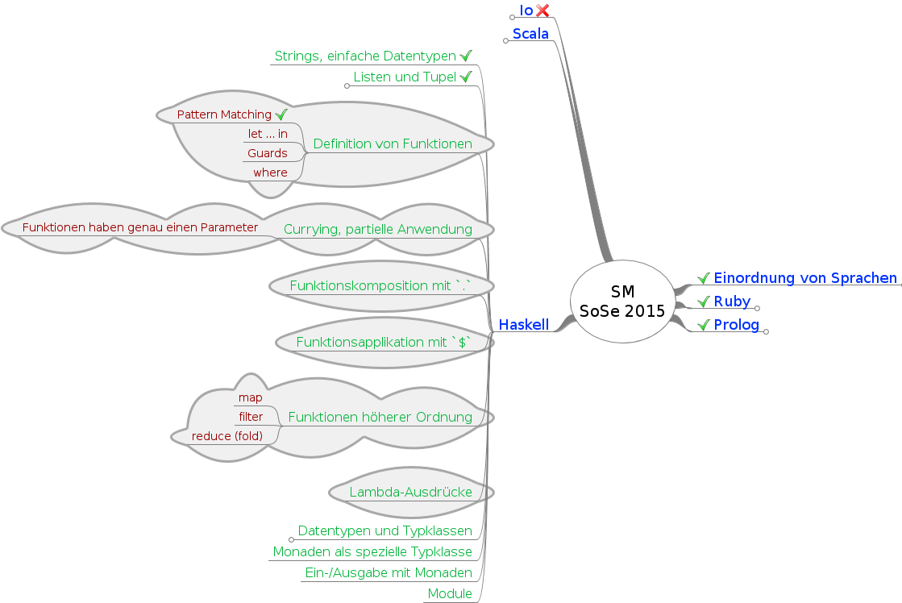

---
title: "VL06: Haskell (Funktionen höherer Ordnung, Currying)"
subtitle: "IFM 5.3 Spezielle Methoden der Programmierung"
author: "Carsten Gips, FH Bielefeld"
date: "18.05.2015"
...


Wiederholung
============

<!-- 5 Minuten: 1 Folie -->


Wiederholung
------------

*   Wie können Sie die ersten $n$ Elemente einer Liste auswählen?

*   Wie können Sie die ersten $n$ Elemente einer Liste entfernen?

*   Was sind "List Comprehensions"?

*   Was ist der Unterschied zwischen den beiden folgenden Aufrufen?

    ```haskell
    zip [1 .. 5] ["one", "two", "three"]
    [(x, y) | x <- [1 .. 5], y <- ["one", "two", "three"]]
    ```

*   Was bedeutet "Pattern Matching" im Zusammenhang mit der Funktionsdefinition?


Motivation
==========

<!-- 5 Minuten -->


Themen für heute
----------------

\centerbegin
{width=90mm}\
\centerend

\notesbegin

Am Ende der VL können/verstehen Sie:

\notesend

*   Funktionen mit Guards und `where` definieren
*   Currying und partiell angewendete Funktionen
*   Funktionen höherer Ordnung: Faltungen, Map, Filter, Lambda-Ausdrücke

\bsp{Mindmap}


Weitere Formen der Verarbeitung von Listen
==========================================

<!-- 20 Minuten: 7 Folien -->


List Comprehensions (Listenverarbeitung)
----------------------------------------

\columnsbegin
\column{0.48\textwidth}

$$
S = \left\{ 2*x \;|\;\; x \in N, x \le 10 \right\}
$$

\column{0.48\textwidth}
\pause
\bigskip
\medskip

```haskell
[x*2 | x <- [1..10]]
```

\columnsend

\pause
\bigskip
\bigskip
\bigskip

```haskell
Prelude> [x*2 | x <- [1..10], x*2>5]

Prelude> let xs = ["A", "B", "C"]
Prelude> [a ++ "-" ++ b | a <- xs, b <- xs]
Prelude> [a ++ "-" ++ b | a <- xs, b <- xs, a < b]

Prelude> [(a,b) | a <- [1..3], b <- [1..a]]
```

\notesbegin

*   List Comprehensions ergeben eine Liste
*   Linke Seite: Ausdruck, der zum Bilden der Listenelemente genutzt wird
*   Rechte Seite:
    *   Generatoren: `a <- xs` bedeutet "Nimm der Reihe nach alle Elemente aus
        `xs` und binde sie an `a`"
    *   Filter: Prädikate, die erfüllt sein müssen, damit das aktuell
        betrachtete Element aus dem Generator in die Ergebnisliste übernommen
        wird
*   Pattern Matching funktioniert auch in List Comprehensions: `[a+b | (a,b) <- xs]`

\notesend

\bsp{ghci}


Beispiel `zipWith`-Funktion
---------------------------

*   Eingabe: Funktion $f$, zwei Listen
*   Rückgabe: Liste
*   Arbeitsweise: Fügt die Listen zusammen, indem für die
    korrespondierenden Elemente jeweils die Funktion  $f$ aufgerufen wird

\Alert{Signatur?}
\pause

```haskell
zipWith :: (a -> b -> c) -> [a] -> [b] -> [c]
```

\Alert{Definition?}
\pause

```haskell
zipWith _ [] _ = []
zipWith _ _ [] = []
zipWith f (x:xs) (y:ys) = f x y : zipWith f xs ys
```

\notesbegin

Anwendung:

```
Prelude> zipWith (+) [4,2,5,6] [2,6,2,3]
Prelude> zipWith max [6,3,2,1] [7,3,1,5]
```

\notesend

\bsp{ghci}


Berechnung der Aktivierung von Neuron $a_j$
-------------------------------------------

Aktivierung von Neuron $a_j$:

$$a_j = \left\{
\begin{array}{lll}
1 & \text{ falls } & w_{0,j} + a_1 w_{1,j} + a_2 w_{2,j} + ... + a_n w_{n,j} \ge 0\\
0 & \text{ falls } & w_{0,j} + a_1 w_{1,j} + a_2 w_{2,j} + ... + a_n w_{n,j} < 0
\end{array}
\right.$$


Zusammenfassung
===============

Was haben Sie heute gehört?
---------------------------

*   Funktionsdefinition mit Guards, mit Where-Bindings und Let-in

*   Funktionen haben in Haskell genau **einen** Parameter

*   **Currying**: Partielle Anwendung einer Funktion auf einen Parameter
    liefert Funktion mit restlichen Parametern

*   Funktionskomposition mit `.`

*   Funktionen höherer Ordnung: Funktionen als Parameter oder Rückgabe

    \blueArrow Beispiele: `map`, `filter`, `foldl` ("reduce")

*   Anonyme Funktionen mit Lambda-Ausdrücken

\vfill

**Nächste Woche**: Haskell (Typen und Typklassen)


Literatur zum Weiterlesen
-------------------------

*   Miran Lipovaca: "Learn You a Haskell for Great Good!",
    [learnyouahaskell.com](http://learnyouahaskell.com)

    \smallskip

*   O’Sullivan, Stewart, Goerzen: "Real World Haskell",
    [book.realworldhaskell.org](http://book.realworldhaskell.org)

    \smallskip

*   Bruce A. Tate: "Seven Languages in Seven Weeks", Pragmatic Bookshelf Inc., 2010
    *   Haskell: Kapitel 8

    \smallskip

*   Block, Neumann: "Haskell Intensivkurs", Springer, 2011


Lernziele -- Nach dieser Vorlesung sollten Sie ...
--------------------------------------------------

### Verstehen (K2)
*   Funktionen haben in Haskell einen Parameter
*   Prinzip des Currying (schrittweise partielle Applikation)
*   Signatur von Funktionen höherer Ordnung
*   Currying oft lesbarer als Lambda-Ausdrücke

\smallskip

### Anwenden (K3)
*   Funktionsdefinition mit Guards und Pattern Matching
*   Nutzung von Where-Bindings und Let-in
*   Komposition von Funktionen mit `.`
*   Umgang mit `map`, `filter`, `foldl`, `zip`, ...
*   Nutzung von Lambda-Ausdrücken


Diese Fragen sollten Sie beantworten können ...
-----------------------------------------------

*   Worin besteht der Unterschied zwischen Guards und Pattern Matching?

*   Worin besteht der Unterschied zwischen Where-Bindings und Let-in-Ausdrücken?

*   Erklären Sie Currying an einem Beispiel. Worin liegt die praktische Bedeutung
    von partieller Applikation?

*   Was sind Lambda-Ausdrücke?


Diese Fragen sollten Sie beantworten können ...
-----------------------------------------------

*   Erklären Sie `foldl` an einem Beispiel.

*   Was bedeuten die folgenden Code-Schnipsel?

    ```haskell
    map (+ 1) [1, 2, 3]
    filter odd [1, 2, 3, 4, 5]
    foldl1 (+) 0 [1 .. 3]
    ```


Diese Fragen sollten Sie beantworten können ...
-----------------------------------------------

*   Schreiben Sie im folgenden Code-Schnipsel `fibNth` mit Hilfe von
    Funktionskomposition um:

    ```haskell
    lazyFib x y = x:(lazyFib y (x + y))
    fib = lazyFib 1 1
    fibNth x = head (drop (x - 1) (take (x) fib))
    ```

*   Definieren Sie eine Funktion `fib5th` durch partielle Applikation.
