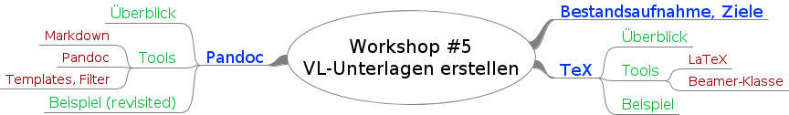
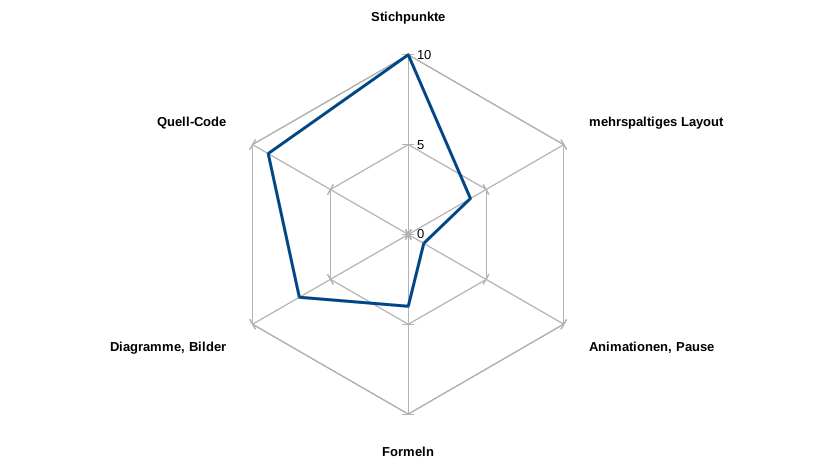
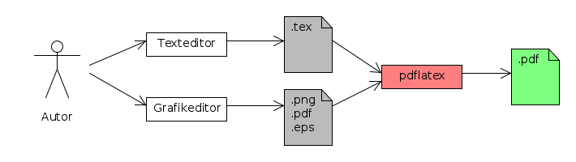

---
title: "Discover the Zen of Presenting"
subtitle: "Vorlesungsunterlagen (inkl. E-Books) mit Pandoc und LaTeX erstellen"
author: "Carsten Gips, FH Bielefeld"
date: "08.09.2015"
...


Motivation
==========

<!-- 15 Minuten -->

Die Reise beginnt
-----------------

\bigskip

\

\bigskip
\bigskip
\bigskip

\notesbegin

Am Ende des Workshops haben Sie einen guten Überblick über:

\notesend

*   Unterlagen (PDF) mit LaTeX und Beamer erstellen
*   Pandoc und Markdown: Arbeitserleichterung und moderne Formate

\bsp{Vorstellung, Abfrage Erfahrungen}


Wozu dienen mir die Folien
--------------------------

1.  Vortrag
    -   Roter Faden in VL für Vortragenden, Visualisierung für Studis

\smallskip

2.  Handout
    -   Angereichert mit weiteren Beispielen und Informationen
    -   Komprimierteres Layout (Seitensparen beim Ausdrucken)
    -   Auf E-Readern und Tablets besser nutzbares Format

\smallskip

3.  ILIAS
    -   Lernmodul (VL als HTML)


Technischer Blick
-----------------

-   **Eine** Quelle, um daraus die gewünschten Formate zu generieren

\smallskip

-   **Versionierung**: Was habe ich wann warum geändert/ergänzt/rausgenommen/...?!
    -   Was habe ich den Studis in welchem Semester gegeben?
    -   Wo liegen die Unterschiede zw. den Semestern?


\notesbegin

**Was habe ich auf den Folien**

\

\bsp{Beispiel-VL (Slides)}

\notesend


Womit erstelle ich die Folien
-----------------------------

-   Früher: PowerPoint
    -   Keine sinnvolle Versionsverwaltung
    -   Kein eigenes Code-Highlighting
    -   Kein vernünftiger Handout-Export
    -   Kein Export in moderne Formate

\smallskip

-   Zwischenzeitlich: LaTeX und Beamer-Klasse

\smallskip

-   Heute: Markdown für Standarddinge, Rest mit LaTeX-Makros
    -   Pandoc: Export in Zielformate


LaTeX mit Beamer-Klasse
=======================

<!-- 15 Minuten inkl. Live-Demo -->

LaTeX mit Beamer-Klasse
-----------------------

\

\bigskip
\bigskip

Autor
:   Text und logische Struktur (LaTeX-Befehle)

LaTeX
:   Typographie und Satz (gesteuert durch *Dokumentklasse*)


\notesbegin

**Kurze Geschichte**

*   Ab 1977: Donald Knuth entwickelt Textsatzsystem TeX
    *   TeX: der eigentliche Compiler
    *   plainTeX: Standard-Makrosammlung

*   Ab 1980: Leslie Lamport entwickelt umfangreiche,
    benutzerfreundliche Sammlung von TeX-Makros zur leichteren
    Verwendung: LaTeX

*   LaTeX wird permanent weiterentwickelt, aktuell LaTeXe

*   Nutzung vor allem Bereich des wissenschaftlichen Schreibens

\notesend


\notesbegin

**Workflow**

*   Der Autor erstellt ein Manuskript
    \blueArrow Textdatei angereichert mit LaTeX- und/oder TeX-Befehlen

*   Erzeugen einer PDF-Datei mit dem Programm `pdflatex`
    \blueArrow "programmierte Texte"

\notesend


\notesbegin

**Trennung von Inhalt und Layout:**

*   Autor erstellt Text und gibt logische Struktur vor

*   TeX kümmert sich um Typographie und Satz
    *   Konkretes Layout ergibt sich u.a. durch verwendete *Dokumentklasse*
    *   Spezielle Dokumentklasse für Präsentationen:
        ["Latex Beamer"](http://latex-beamer.sourceforge.net/)
        *   Handouts als komprimierte Fassung der Folien möglich

\notesend


Was muss ich alles installieren?
--------------------------------

*   TeX-Distribution:
    -   Linux: [TeX Live](http://www.tug.org/texlive/)
    -   Windows: [MiKTeX](www.miktex.org)
    -   Mac: [MacTEX](http://www.tug.org/mactex)

*   Dokument-Klasse ["Latex Beamer"](http://latex-beamer.sourceforge.net/)^[i.d.R. bereits in TeX-Distribution enthalten]

*   Texteditor, alternativ IDE ([Eclipse](http://www.eclipse.org/downloads)
    plus [Texlipse-Plugin](http://texlipse.sourceforge.net))

\bsp{Eclipse beispiel-tex/beamer.tex; Styles und Slides+Handout zeigen}


Fazit LaTeX und Beamer
----------------------

-   Sinnvolle Versionsverwaltung
-   Umfangreiches Code-Highlighting
-   Platzsparende Handouts aus selber Quelle
-   Zusatzinhalte im Handout
-   Zusätzliche "Spielerchen":
    -   Automatisches Inhaltsverzeichnis
    -   Navigationsleisten

\pause

\Alert{Aber:}

-   Kein Export in moderne Formate: nur PDF
-   Viel Boilerplate-Code: ca. 50% nur LaTeX-/Beamer-Code
    -   Steile Lernkurve für LaTeX-Einsteiger


Markdown und Pandoc
===================

<!-- 15 Minuten inkl. Live-Demo -->

Markdown
--------

> A Markdown-formatted document should be publishable as-is, as plain text,
> without looking like it's been marked up with tags or formatting
> instructions.
>
> \hfill -- John Gruber

\bsp{Eclipse beispiel-md/markdown.md}


Pandoc: General Markup Converter
--------------------------------

\bigskip

> Pandoc is a Haskell library for **converting from one markup format to
> another**, and a command-line tool that uses this library.

\bigskip

> It can read **markdown** and ... and Word docx; and
> it can write plain text, markdown, ... ,
> **HTML 5**, **LaTeX** (including **beamer slide shows**), ..., **EPUB**
> (v2 or v3), ..., reveal.js or S5 HTML slide shows. It can also produce
> **PDF output** on systems where LaTeX is installed.

\bigskip

> Pandoc's **enhanced version of markdown** includes syntax for footnotes,
> tables, flexible ordered lists, ...
>
> \hfill -- Pandoc Manpage (by John McFarlane)

\bsp{pandoc markdown.md}


\notesbegin

**Alternative: AsciiDoc**

*   Ähnliches Textformat wie Markdown, aber komplexer
    *   [AsciiDoc](http://www.methods.co.nz/asciidoc/)
    *   [Wikipedia: Vergleich von Markup-Sprachen](http://en.wikipedia.org/wiki/Lightweight_markup_language)

*   Weiterverarbeitung: `AsciiDoc -> DocBook -> DBLatex -> PDF` oder
    `AsciiDoc -> DocBook -> XSL-FO -> PDF/HTML`
    *   Konvertierung nach [DocBook](http://www.docbook.org/) (spezielles
        XML-Format), etwa mit [AsciiDoctor](https://github.com/asciidoctor)
    *   Weiterverarbeitung nach PDF oder HMTL/EPUB mit Tools wie
        -   [DBLatex](http://dblatex.sourceforge.net/) (DocBook nach PDF)
        -   [XSLTProc](http://xmlsoft.org/XSLT/) und
            [DocBook XSL Stylesheets](http://docbook.sourceforge.net/projects/xsl/)
            (DocBook nach XSL-FO oder HTML)
        -   [Apache FOP](http://xmlgraphics.apache.org/fop/) (XSL-FO nach PDF)

*   Nachteile:
    -   Folien sind in DocBook eigentlich nicht vorgesehen (Dokumenttypen:
        `book`, `article`, `manpage`)
        -   Hinweis: [AsciiDoctor](https://github.com/asciidoctor) kann
            HTML/JavaScript-Präsentationen aus AsciiDoc erzeugen
    -   Eigene Erweiterungen vergleichsweise schwierig umzusetzen (nur über XSLT ...)
    -   Keine TeX-Makros einsetzbar^[Ärgerlich, da LaTeX Standard bei
        wissenschaftlichen Publikationen ist und entsprechend beim Autor viele
        Makros vorhanden und im Einsatz sind.]

\notesend


Was muss ich alles installieren?
--------------------------------

*   [Pandoc](http://johnmacfarlane.net/pandoc/)

*   Texteditor, alternativ IDE ([Eclipse](http://www.eclipse.org/downloads)
    plus Markdown-Plugin)

\smallskip

*   Optional:
    *   PDF via LaTeX: TeX-Distribution
    *   Eigene Filter (AST-Transformation):
        -   [Python](http://www.python.org/)
        -   Python-Bindings für Pandocs Filter:
            [Python Pandocfilters](https://pypi.python.org/pypi/pandocfilters/)
    *   Unterstützung für "Citation Style Language":
        [Pandoc Citeproc](http://hackage.haskell.org/package/pandoc-citeproc)

\bsp{Eclipse beispiel-md/vl06.tex; beamer.tex zum Vergleich; Build-Datei und Ergebnis}


\notesbegin

**Anmerkungen**

*   Meta-Informationen (etwa Autor, Titel oder Datum) als "*Pandoc Title Block*"
    oder "*YAML Metadata Block*" im Dokument definieren:
    *   Pandoc Title Block (am **Anfang** des Dokuments):

        ```
        % title
        % author(s) (separated by semicolons)
        % date
        ```

    *   YAML Metadata Block:

        ```
        ---
        title: "Discover the Zen of Presenting"
        subtitle: "Vorlesungsunterlagen (inkl. E-Books) mit Pandoc und LaTeX erstellen"
        author: "Carsten Gips, FH Bielefeld"
        date: "08.09.2015"
        ...
        ```

*   Einstellungen zum Beamer-Style bzw. der Article-Klasse, der Schriftgröße etc
    können i.d.R. als Parameter beim Pandoc-Aufruf mitgegeben werden:
    `-V parametername=wert`, beispielsweise
    `-V lang=german -V theme=default -V colortheme=rose`
    *   Voraussetzung: Template wertet diese Parameter auch aus
    *   Alternativ eigene Templates aus den Default-Templates ableiten
    *   Default-Template ausgeben lassen: `pandoc --print-default-template=beamer`
        gibt das bei der Erzeugung von LaTeX-/Beamer-Folien genutzte Template aus
        (analog `pandoc --print-default-template=latex` für mit LaTeX erzeugte
        PDFs oder `pandoc --print-default-template=epub` bzw.
        `pandoc --print-default-template=html` für EPUB oder HTML)

*   Eigene Elemente/Erweiterungen (im Beispiel `\bsp{}`, `\notesbegin`, ...):
    *   Als LaTeX-Makro definieren und einbinden (direkt im Template oder in
        extra Datei und Laden über Parameter bei Pandoc-Aufruf:
        `--include-in-header=definitions.tex`)
    *   Wirkung bei Nicht-TeX-Ausgabeformat:
        *   Einfache Befehle wie `\notesbegin` werden ignoriert
        *   Befehle mit Argument wie `\bsp{}` werden mitsamt dem Argument
            ignoriert \blueArrow damit verschwindet bei `\bsp{XXX}` das `XXX`!
    *   Für entsprechende Wirkung im HTML-Output muss Pandoc-Filter definiert
        werden: Transformation in entsprechende HTML-Umgebungen; evtl. zusätzliche
        Formatierung über eigenes CSS

*   Für HTML-Ausgaben kann die Formatierung mit eigenen CSS-Definitionen
    gesteuert werden

*   Für LaTeX-Ausgaben können LaTeX-Pakete und -Befehle genutzt werden

\notesend


Fazit Markdown und Pandoc
-------------------------

-   Wie TeX:
    -   Sinnvolle Versionsverwaltung
    -   Umfangreiches Code-Highlighting
    -   Platzsparende Handouts aus selber Quelle
    -   Extra Inhalte im Handout einfach möglich
    -   Zusätzliche "Spielerchen" wie bei TeX (automatisches Inhaltsverzeichnis)

    \smallskip

-   Export in alle modernen Formate
-   Arbeitserleichterung: Markdown für Standarddinge, Rest mit LaTeX-Makros


Zusammenfassung
===============

<!-- 15 Minuten -->

Was haben Sie heute gehört?
---------------------------

-   Markdown als "simple" TeX :-)

\smallskip

-   Pandoc: Markdown \blueArrow LaTeX/Beamer, LaTeX/PDF, HTML, EPUB
-   Eigene Strukturen über TeX-Makros und passende Pandoc Filter


Die Reise geht weiter ...
-------------------------

-   Alle VLs als "Buch" zusammenbinden

-   Interaktive VL-Unterlagen: "Erzähl- bzw. Lern-Stränge" (Verlinkung)

-   Selbststudiumsfragen zur Lernfortschrittskontrolle im ILIAS-Lernmodul

-   HTML5-Präsentationen mit Markdown-Input: [Reveal.js](http://lab.hakim.se/reveal-js/)

-   Corporate Design


Fragen für Ergebnisreflexion (Abschlussrunde)
---------------------------------------------

1)  Handlungsempfehlungen

2)  Herausforderungen

3)  Perspektiven


Literatur zum Weiterlesen
-------------------------

*   Pandoc, TeX, Markdown:
    *   Pandoc: [johnmacfarlane.net/pandoc](http://johnmacfarlane.net/pandoc/)

    *   LaTeX, Beamer-Klasse: [tug.org/texlive](http://www.tug.org/texlive/)

    *   Markdown: [daringfireball.net/projects/markdown](http://daringfireball.net/projects/markdown/)

    \smallskip

*   Hintergründe:
    *   Kieran Healy: [Plain Text, Papers, Pandoc](http://kieranhealy.org/blog/archives/2014/01/23/plain-text)
    *   Kieran Healy: [Resources](http://kieranhealy.org/resources/)

    *   Kofler: [Sackgasse LaTeX](https://kofler.info/sackgasse-latex/)
    *   Kofler: [Kindle-Ebooks mit Pandoc](https://kofler.info/kindle-ebooks-mit-pandoc-erstellen/)

    \bigskip

*   Alternative AsciiDoc?
    *   Opensourcepress: [Bye Bye LaTeX](http://www.opensourcepress.de/de/blog/2013/05/bye_bye_latex.php)
    *   Opensourcepress: [AsciiDoc vs. Markdown](http://www.opensourcepress.de/de/blog/2013/05/asciidoc_markdown.php)

    *   [HTML5-Präsentationen mit AsciiDoc](http://mojavelinux.github.com/decks/)
